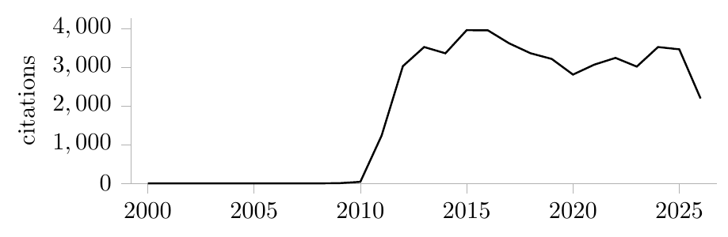

# inspirehep-latex

Live [INSPIRE-HEP](https://inspirehep.net) citation counts, titles, references,
and plots in LaTeX — for a CV, a proposal, or a paper.

## Quick start

**1. Put two files beside your `.tex` file.**

```sh
BASE=https://raw.githubusercontent.com/lawrenceleejr/inspirehep-latex/main
curl -O $BASE/inspirehep.sty          # the package itself
curl -O $BASE/inspirehep-fetch.py     # what it runs to fetch (standard library only)
```

**2. Load the package.**

```latex
\usepackage{inspirehep}
```

**3. Ask for something.** Every command takes an INSPIRE id — either the number
from the record's URL (`inspirehep.net/literature/`**`1701002`**) or its texkey
(`Lee:2018pag`). The package tells the two apart by shape.

```latex
\inspirepub{1701002}
```

**4. Compile twice, with `-shell-escape`.**

```sh
pdflatex -shell-escape mydoc.tex
pdflatex -shell-escape mydoc.tex
```

> **Collider Searches for Long-Lived Particles Beyond the Standard Model** [245 citations]

The first pass notices what the document asks for and fetches it; the second
typesets it — the same two-pass shape as a table of contents, cross-references,
or a bibliography. `-shell-escape` is what lets the package run the fetcher for
you; without it LaTeX may not start another program.

After that the figures live in a generated file beside your document, so **it
compiles anywhere** — offline, on a colleague's machine, with no `-shell-escape`
at all. Nothing needs refetching until you want the numbers brought up to date.

### If you cannot use `-shell-escape`

Overleaf disables it, and so do some locked-down TeX installations. Run the
fetcher yourself, then compile normally — it writes the same file, so the
document cannot tell the difference:

```sh
python3 inspirehep-fetch.py mydoc.tex
pdflatex mydoc.tex
```

On Overleaf, where you cannot run it at all, see [Overleaf](#overleaf) below.

## What you can ask for

### A paper

`\inspirepub` is the one from step 3 — the title comes from INSPIRE, and the
citation count follows it. Options choose what else appears: `year` adds the
publication year, and `title=` supplies your own wording instead of INSPIRE's:

```latex
\inspirepub[year]{2642414}
\inspirepub[title={A title in my own words}]{2642414}
```

> **Towards a muon collider** [407 citations] (2023)
>
> **A title in my own words** [407 citations]

For a full reference, as INSPIRE itself formats it:

```latex
\inspireref[cites=false]{1701002}
```

> L. Lee, C. Ohm, A. Soffer and T. T. Yu, "Collider Searches for Long-Lived
> Particles Beyond the Standard Model," Prog. Part. Nucl. Phys. **106** (2019),
> 210-255 doi:10.1016/j.ppnp.2019.02.006 [arXiv:1810.12602 [hep-ph]].

Each piece is also a command of its own: `\inspiretitle`, `\inspirecites`,
`\inspireyear`, `\inspirekey`.

### A person

Author commands take the id of the person they ask about, so one document can
discuss several:

```latex
Over \inspirepapers[round=100]{1071846} papers, over
\inspirecitations[round=1000]{1071846} citations, $h$-index
\inspirehindex{1071846}.
```

> Over 1,400 papers, over 207,000 citations, *h*-index 211.

`round=` rounds **down**, so a claim of "over N" stays true as the real figure
grows.

### Citing a paper

`\inspirecite` is `\cite` by INSPIRE id. The fetcher collects INSPIRE's own
BibTeX entry for everything you cite into `inspirehep-refs.bib`, so you never
handle a citation key:

```latex
as shown in \inspirecite{1701002}
...
\bibliographystyle{unsrt}
\bibliography{inspirehep-refs}
```

> as shown in [1]
>
> **[1]** Lawrence Lee, Christian Ohm, Abner Soffer, and Tien-Tien Yu. Collider
> Searches for Long-Lived Particles Beyond the Standard Model. *Prog. Part.
> Nucl. Phys.*, 106:210–255, 2019.

Run `bibtex` between the two `pdflatex` passes, as you would for any
bibliography. The `.bib` file is written by the fetch, so it needs no editing —
and `\inspirekey{<id>}` hands you the key if something else wants it.

### A plot

Load with the `plots` option — it pulls in `pgfplots`, which a document that
never plots should not pay for:

```latex
\usepackage[plots]{inspirehep}
...
\inspireauthorplot{1071846}{citations}
```



`{papers}` instead of `{citations}` plots output rather than impact, and
`\inspireplot{<id>}` is one paper's citation history. The style is deliberately
spare — one line, axis lines only where they carry information, no grid, box,
marks, or legend — and `\inspireplotstyle` takes any `pgfplots` axis keys if
you want otherwise.

## Keeping a document current automatically

`example/refresh-inspire.yml` is a GitHub Actions workflow you can copy into a
repository. On every push, weekly, and on a button, it fetches the figures for
your main `.tex`, commits the data file it writes, and keeps a copy as a run
artifact.

It downloads the fetcher from this repository at run time, so nothing from
inspirehep needs to live in your document's repository — no script, no
submodule. Set `PKG_REF` to a tag instead of `main` if you would rather pin the
version. Only `inspirehep.sty` has to reach whatever compiles the document,
which on Overleaf means uploading it to the project once.

### If the document lives in the repository

Link the Overleaf project to it — *Menu → Sync → GitHub* — and the refreshed
figures arrive with everything else via *Sync → GitHub → Pull GitHub changes*.
No URL anywhere.

**Overleaf will refuse the first time**, because GitHub requires the `workflow`
OAuth scope before any app may write under `.github/workflows/`, and Overleaf's
sync pushes the whole tree:

> The Overleaf GitHub sync service couldn't sync GitHub Workflow files (in
> `.github/workflows/`). Please authorize Overleaf to edit your GitHub workflow
> files and try again.

Take it literally: there is a button to **authorize workflow editing**. Click it,
retry the link, and it works. If that first attempt already created the
repository before failing, delete the orphan or choose a new name.

Overleaf's GitHub sync is a paid feature and does not poll — you press Pull, so
the numbers move when you are looking at the document rather than behind your
back. And since the workflow commits, a later *Push Overleaf changes* can
conflict on the data file; pull first and it resolves, because nothing but the
fetcher ever edits it.

### If the document lives only in Overleaf

Then the repository exists just to run the fetcher, and one file has to cross
over. *Add file → From external URL*:

```
https://raw.githubusercontent.com/<user>/<repo>/main/inspirehep-data.tex
```

named `inspirehep-data.tex`. Overleaf then shows a **Refresh** button on that
file, which re-fetches whatever the workflow last committed. This route needs no
Overleaf-to-GitHub authorisation at all.

### Two notes on the workflow itself

It commits rather than relying on its own **artifact**, because Overleaf cannot
read one either way: artifacts are served as ZIP archives rather than as the file
itself, and downloading one needs an authenticated request even on a public
repository, while Overleaf issues a plain unauthenticated GET.

Its own commit does **not** re-trigger it: a push made with the default
`GITHUB_TOKEN` does not start further workflow runs. The `[skip ci]` in the
commit message is the backstop for anyone who swaps in a personal access token,
which does.

Overleaf cannot run the fetcher itself — no shell escape, no network — which is
what the workflow is for.

## Install, other ways

Step 1 above is the whole package: `inspirehep.sty` is all LaTeX needs, and
everything else in this repository is documentation, an example, and that
helper. `inspirehep.sty` can equally live anywhere in your `TEXINPUTS`.

To track the package from a document's own repository, carry it as a submodule
and point `TEXINPUTS` at it from your build script:

```sh
git submodule add https://github.com/lawrenceleejr/inspirehep-latex
export TEXINPUTS=".:inspirehep-latex:${TEXINPUTS:-}"
```

That value ends in an empty entry, which is what keeps TeX searching its own
trees as well; without it the package would be the only thing it could find.

Keep `\usepackage{inspirehep}` unqualified rather than writing the submodule
path into it. The bare name resolves through `TEXINPUTS` locally and also finds
the file when it sits beside the sources, which is what Overleaf needs — its Git
sync does not fetch submodules, so there you upload `inspirehep.sty` to the
project root. A path-qualified `\usepackage` finds neither, and warns that the
name it was given is not the name the package provides.

## Getting the numbers

The figures come from `inspirehep-data.tex`. There are two ways to produce it,
and they write the same file — use whichever suits your setup.

**Let the package do it.** With unrestricted shell escape (and `python3` on
the path), the package refreshes at the end of the run and writes the file
itself:

```sh
pdflatex -shell-escape cv.tex     # fetches, writes inspirehep-data.tex
pdflatex -shell-escape cv.tex     # numbers appear
```

Two passes the first time, like a cross-reference. After that it only refetches
when there is a reason: a publication you just added, or figures older than
`maxage`. Commit `inspirehep-data.tex` and everyone else can compile normally.

**Or run the helper.** If you cannot enable shell escape — a locked-down
machine, a CI policy, Overleaf — `inspirehep-fetch.py` does the same job from
outside the compile. It needs only the Python standard library:

```sh
python3 inspirehep-fetch.py       # writes inspirehep-data.tex
```

It finds your records and your author id by reading your sources, so it takes no
arguments in the common case.

## Overleaf

Overleaf disables shell escape and its compile containers have no network, so
**nothing can fetch there** — but the CV renders correct numbers, because they
are just an `\input` file. Two ways to keep that file current:

1. **Linked file.** Upload `inspirehep.sty`, then add `inspirehep-data.tex`
   with *Add file → From external URL*, pointed at the raw URL of the file in
   your CV's repository. Overleaf gives linked files a **Refresh** button, so
   you can pull fresh numbers without leaving the editor. Keep the repository
   copy current from CI or a local run, and refreshing is one click.
2. **GitHub sync.** If your project is linked to a repository, pull as usual.
   Note that Overleaf's sync does not fetch git submodules, so include
   `inspirehep.sty` as a file rather than a submodule.

Setting `fetch=off` on Overleaf silences the machinery entirely, though `auto`
already degrades to exactly the same behaviour.

## Commands

**Records.** Name a record either by its recid — the number in the INSPIRE
URL, `inspirehep.net/literature/`**`2642414`** — or by its INSPIRE texkey,
`Accettura:2023ked`. Every command takes either; they are told apart by shape,
so nothing has to be declared, and both link to the record by number.

```latex
\inspirepub{2642414}          % by recid
\inspirepub{Accettura:2023ked} % the same paper, by texkey
```

| Command | Result |
| --- | --- |
| `\inspirepub[<opts>]{<id>}` | the entry: title (fetched), linked, with its citation count |
| `\inspiretitle{<id>}` | the title alone |
| `\inspireref[<opts>]{<id>}` | the full reference, exactly as INSPIRE formats it |
| `\inspirecites{<id>}` | the citation count alone |
| `\inspireyear{<id>}` | the publication year |
| `\inspirekey{<id>}` | the BibTeX key |
| `\inspirecite{<id>}` | `\cite` with that key |
| `\inspireplot[<opts>]{<id>}` | citations per year, as a line |

`\inspirepub` takes options for exactly what it shows:

```latex
\inspirepub{2642414}                    % title + count
\inspirepub[year]{2642414}              % ... and the year
\inspirepub[ref]{2642414}               % the full reference instead of the title
\inspirepub[cites=false]{2642414}       % no count
\inspirepub[link=false]{2642414}        % no hyperlink
\inspirepub[title={My own words}]{2642414}   % your title, INSPIRE's count
```

**People.** The id is the number in a profile URL,
`inspirehep.net/authors/`**`1071846`**, or a BAI such as `J.Smith.1`.

| Command | Result |
| --- | --- |
| `\inspirepapers[<opts>]{<id>}` | publication count |
| `\inspirecitations[<opts>]{<id>}` | citation count |
| `\inspirehindex[<opts>]{<id>}` | *h*-index |
| `\inspireauthorstat[<opts>]{<id>}{<key>}` | any of the three by name |
| `\inspireauthorplot[<opts>]{<id>}{papers\|citations}` | that quantity per year, as a line |

All take `round=<n>` to round **down** to a multiple of `n`.

**BibTeX.** `\inspirecite{<id>}` cites by INSPIRE id: the fetcher writes
`inspirehep-refs.bib` containing INSPIRE's own BibTeX entries for every record
you cite, and `\inspirecite` expands to `\cite{}` with the right key. You never
handle a BibTeX key yourself.

```latex
\bibliography{inspirehep-refs}
... as shown in \inspirecite{1701002}.
```

### Fallback figures

Values used only until a real fetch arrives — handy for a repository's first
build, and never overriding fetched data:

```latex
\inspiredefaultauthorstat{1071846}{papers}{1467}   % per person
\inspiredefaultstat{papers}{1467}                  % the helper's --author
```

## Options

Every option is both a package option and a per-call option, so a document sets
house style once and any one entry can depart from it.

| Option | Default | Meaning |
| --- | --- | --- |
| `cites` | `true` | show the citation count |
| `ref` | `false` | show the full reference instead of the title |
| `year` | `false` | append the publication year |
| `errata` | `false` | include any erratum in a reference |
| `collab` | `false` | credit a collaboration paper to the collaboration rather than its first author |
| `link` | `true` | hyperlink the title |
| `title` | *(none)* | override the fetched title |
| `round` | `1` | round a figure down to a multiple of this |
| `sep` | `comma` | thousands separator: `comma`, `period`, `space`, `thin`, `underscore`, `none`, or `sepstring={...}` for anything else |
| `style` | `latex-eu` | INSPIRE reference format: `latex-eu` or `latex-us` |
| `plots` | `false` | load pgfplots, needed for the plotting commands |
| `data` | `inspirehep-data` | basename of the generated file |
| `bib` | `inspirehep-refs` | basename of the generated `.bib` |
| `maxage` | `120` | days before the data is called stale; `0` never warns |
| `mincites` | `1` | counts below this print nothing |
| `script` | `inspirehep-fetch.py` | where the self-fetch finds the helper (a submodule path, say) |
| `fetch` | `auto` | `auto`, `on`, or `off` |

`\inspiresetup{<options>}` changes any of them mid-document.

## Changing how it looks

Three hooks, each redefinable:

```latex
\renewcommand{\inspiretitleformat}[1]{\textbf{#1}}               % the title
\renewcommand{\inspirecitestext}[1]{#1~cites}                    % the words
\renewcommand{\inspirecitesformat}[1]{\nobreakspace{\small[#1]}}  % the wrapper
\renewcommand{\inspireyearformat}[1]{\hfill #1}                  % the year
\renewcommand{\inspireplotstyle}{ymajorgrids, blue}              % plot axis keys
\renewcommand{\inspireplotwidth}{10cm}
\renewcommand{\inspireplotheight}{3cm}
```

To set the annotation in a muted grey, for instance:

```latex
\usepackage{xcolor}
\definecolor{citegrey}{gray}{0.40}
\renewcommand{\inspirecitesformat}[1]{\nobreakspace{\small\color{citegrey}[#1]}}
```

`\inspirepub` links through `hyperref` when your document loads it, and falls
back to plain text when it does not, so load order does not matter.

## How it works, and what it does not do

The package asks INSPIRE for four things: each record's metadata (title,
citation count, BibTeX key), its reference as INSPIRE's own renderer formats it
(`?format=latex-eu` or `latex-us`), its BibTeX entry verbatim
(`?format=bibtex`), and the `earliest_date` facet for anything plotted. Author
figures use the same `citation-summary` aggregation as INSPIRE's profile pages,
so the numbers match what a reader sees there.

All of that lives in `inspirehep-fetch.py`. When the package refreshes itself
through shell escape it runs that same helper, so there is exactly one
implementation of the API handling rather than two that can disagree.

Known limits:

- Refreshing needs `python3` (standard library only); the self-fetch
  additionally needs unrestricted shell escape. Neither is needed to typeset.
- Both fetchers follow `\input`, `\include`, and `\subfile` from the main
  file, resolving names as LaTeX does (relative to the main document) and then
  relative to the including file, as `subfiles` and `import` do. `--no-follow`
  scans only the files named.
- One unknown id degrades on its own: a warning, a visible `[? ...]` marker in
  the output, and the rest of the document still refreshes.
- Counts are whatever INSPIRE reports, including self-citations.

## Developing

```sh
make check     # everything CI runs: lint, unit, test, doc
make lint      # ruff, plus the checks a compiler cannot make
make unit      # the helper's pure parts -- no network, runs in a second
make test      # build the example and look for the numbers in the PDF
make doc       # the manual, as inspirehep-doc.pdf
make ctan      # the archive to upload to CTAN
```

`make unit` is the one to run while editing: it covers the patterns that find
records in a document, the `\input` walking, the TeX escaping, and the shape of
the generated file, none of which touch the network.

`make lint` additionally asserts what a compiler cannot see — that every public
command and option reached the manual, that `inspirehep.sty` and the `Makefile`
agree on the version, and that a handful of traps this package has actually
fallen into stay fixed (an unbalanced `\ExplSyntaxOn`, a colon used as a
separator in a data file, `pgfplots` escaping its option).

CI runs all of it on every push, on three Python versions, and weekly so that a
change at INSPIRE's end shows up here rather than in someone's document.
Tagging `vX.Y` — matching the version in `inspirehep.sty` — builds the CTAN
archive, checks its layout, and drafts a release with it attached.

## Licence

LPPL 1.3c. See `LICENSE`.
